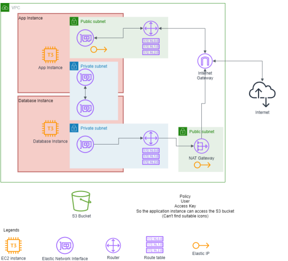

# Cloud_Midterm_Project

This repository for showing Automatically deployment Wordpress application on AWS.

## What's terraform do

Let's see following this

[Link to project detail](information/Project_detail.pdf)

## Infrastructure



## Requirement

For me
I used Linux for install terraform and deployment.

What're you need in linux ?

```bash
$ sudo yum install -y yum-utils
$ sudo yum-config-manager --add-repo https://rpm.releases.hashicorp.com/AmazonLinux/hashicorp.repo
$ sudo yum -y install terraform
```

You have to create user with Role following these policies:

(To make is Easy, Just Allow them to Full Access, but it's not practical in real life)

- EC2FullAccess
- S3FullAccess
- IAMFullAccess

## How to Deploy

1.  Clone this repository.

    `git clone https://github.com/tumrabert/Cloud_Midterm_Project.git`

    (Don't forget to change directory `cd Cloud_Midterm_Project` )

2.  Run `terraform init` to initialize.
3.  Run `mv terraform.tfvars.example terraform.tfvars` to rename .example in to .tfvars
4.  Change variables in file `terraform.tfvars` whatever you want.

    EC2 AMI specfication is **Ubuntu Server 22.04 LTS(HVM) 64 bit**

    (Not Guarantee that If you change AMI, Deployment would be trigger error.)

5.  Run `terraform apply` TO Apply module.
6.  Enter `yes` when this promted was shown.

        Do you want to perform these actions?
        Terraform will perform the actions described above.
        Only 'yes' will be accepted to approve.

7.  Wait Wait Wait
    Until public ip address was show.
    Use that ip for website url.

## Demonstation

[Link To Desmonstation video](https://jam.dev/c/7f911451-1906-460a-92a1-ee8133595973)

## How to access wordpress dashboard

`http://<public-ip-address-of-webserver-ec2instance>/wp-login.php`

Sign in with username and password that you set in `terraform.tfvars`
